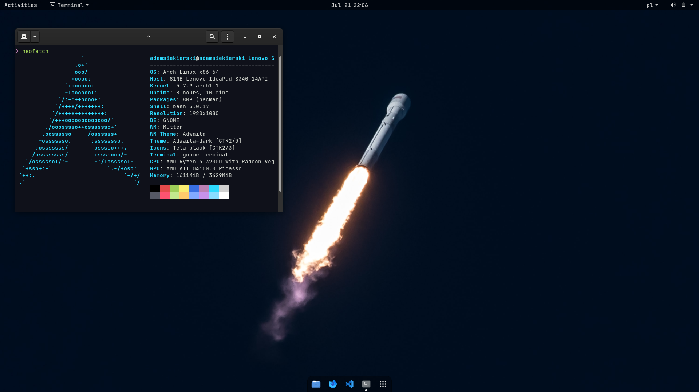

<h2 align="center">
My Arch Linux Setup
</h2>

### Config files

- `gnome-terminal` - Here you can find my Gnome terminal profile, with Material Theme Ocean, based off https://github.com/material-theme/vsc-material-theme

### Operating System

- I have a basic install of Arch Linux 2020.07.01
- The WM is GNOME on Wayland, most basic version from `gnome` package
- The shell I'm using is ZSH, I will upload the config later (for now I'm just using [`slimzsh`](https://github.com/changs/slimzsh), but it is going to change)
- My IDE is VSCode (you can find the setup on my [website](https://siekierski.ml/uses)), and the web browser is Firefox Developer Edition

### GNOME

- Theme: `Adwaita Dark`
- Icons: `Tela Black`
- Background: https://unsplash.com/photos/pnPS3Ox_2vE
- Font: `JetBrains Mono`
- Extensions:
  - Dash to dock
  - Dynamic panel transparency
  - Blyr
  - Horizontal workspaces
- Terminal theme: My custom ported Material Ocean
